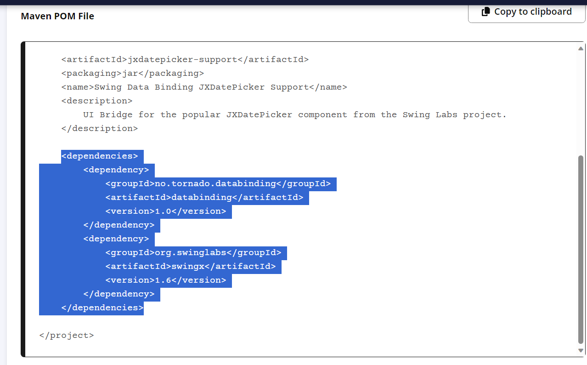

# Java Chat System
- A chat system with separate modules for administrators and users.
- For database design, system design and more detailed info about the project, refer to the folder: **21127119_21127089_21127717**

## Note on pom.xml

### Adding dependencies

1. Search for dependency: https://central.sonatype.com/ and we get this `Maven POM File` snippet.
   
2. Copy `<dependency>` block and paste into the <dependencies> section of pom.xml.

### Adding resources (i.g: .png, .jpg, etc)

- `Resources` folder is to store images or other files except java. Every file in this folder can be accessed with absolute path.

E.g: Let's say there is _sample.png_ in `Image` inside of `Resources`, path to _sample.png_ is: `/Image/sample.png`. Remember to include the / before Image.

### Apply changes

- On changing `pom.xml`, to apply changes run: `.\mvnw clean`.

## Instructions for use

Please refer to the [Instructions for Use section](https://github.com/DeadlineShooters/Java-Chat-System/blob/main/21127119_21127089_21127717/Report.pdf) in our project report for more details.
