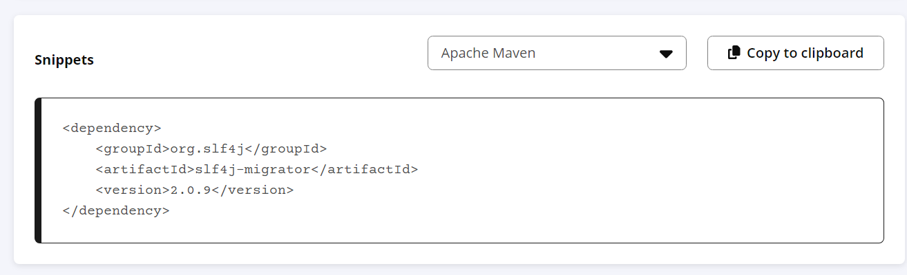
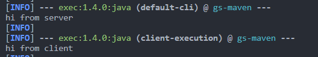

- In this project, we use the MVC pattern:
  - The Model component manages the system data and associated operations on that data.
  - The View component defines and manages how the data is presented to the user.
  - The Controller component manages user interaction (e.g., key presses, mouse clicks, etc.) and passes these interactions to the View and the Model.

## Note on pom.xml

### Adding dependencies

1. Search for dependency: https://central.sonatype.com/ and we get this `Apache Maven` snippet.
   
2. Copy `<dependency>` block and paste into the <dependencies> section of pom.xml.

### Adding resources (i.g: .png, .jpg, etc)

- `Resources` folder is to store images or other files except java. Every file in this folder can be accessed with absolute path.

E.g: Let's say there is _sample.png_ in `Image` inside of `Resources`, path to _sample.png_ is: `/Image/sample.png`. Remember to include the / before Image.

### Apply changes

- On changing `pom.xml`, to apply changes run: `.\mvnw clean`.

## Running the project

For more detail on how this works, check `pom.xml`.
In **powershell**:

- Run Server:
  `.\mvnw exec:java`
- Run Client:
  `.\mvnw exec:java@client-execution`

### Output

For simple console output:
Check for lines starting with default-cli (server app) and client-execution (client app)

